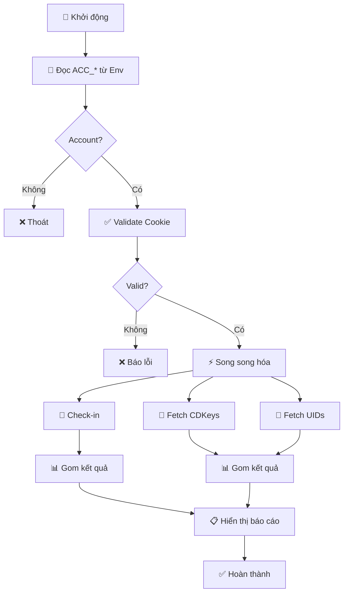

# 🎮 HoYoLab Auto Tool

Tự động **điểm danh hàng ngày** và **nhập redeem code** cho 3 game HoYoverse thông qua GitHub Actions.

## ✨ Tính năng

| Tính năng | Mô tả |
|-----------|-------|
| 🎁 **Auto Check-in** | Điểm danh hàng ngày nhận phần thưởng |
| 🔑 **Auto Redeem** | Tự động nhập mã code mới nhất |
| 🔄 **Multi-Account** | Hỗ trợ nhiều tài khoản |
| ⚡ **Cross-region Skip** | Tự động bỏ qua code hết hạn |
| 🚀 **High Performance** | Tối ưu tốc độ với kiến trúc song song (Parallel) |
| 🛡️ **Stealth Mode** | Header động tránh bị phát hiện |

## 🎯 Game được hỗ trợ

| Game | Check-in | Redeem |
|------|----------|--------|
| Genshin Impact | ✅ | ✅ |
| Honkai: Star Rail | ✅ | ✅ |
| Zenless Zone Zero | ✅ | ✅ |

## 🏗️ Kiến trúc hệ thống



## 🚀 Bắt đầu nhanh

### 1. Fork Repository

Click **Fork** ở góc phải trên GitHub.

### 2. Lấy Cookie

1. Truy cập [HoYoLab](https://www.hoyolab.com) và **đăng nhập**
2. Click vào avatar → **Personal Homepage**
3. Mở **DevTools** (F12) → Tab **Network**
4. Tìm request: `getGameRecordCard?uid=...`
5. Click vào request → **Headers** → Copy giá trị **Cookie**

```
Cookie: mi18nLang=en-us; _MHYUUID=xxx; cookie_token_v2=xxx; account_id_v2=xxx; ...
```

> ⚠️ **Lưu ý:** Cookie này sẽ dán vào GitHub Secrets - KHÔNG commit vào code!

### 3. Thêm Secrets

1. Vào repo đã fork → **Settings** → **Secrets and variables** → **Actions**
2. Click **New repository secret**
3. **Name**: `ACC_1` (hoặc `ACC_2`, `ACC_3`,...)
4. **Value**: Dán cookie string vừa copy
5. Lặp lại cho mỗi account

> 💡 GitHub Actions sẽ tự nhận diện các biến `ACC_*` khi chạy!

### 4. Chạy Workflow

- **Tự động**: Mỗi ngày lúc **4:45 AM (UTC+7)**
- **Thủ công**: **Actions** → **Daily Run** → **Run workflow**

## 📁 Cấu trúc dự án

```
hoyoverse-utility/
├── .github/workflows/
│   └── hoyo-flow.yml          # GitHub Actions workflow
├── src/
│   ├── main.py                # Entry point chính
│   ├── config.py              # Cấu hình tập trung
│   ├── api/
│   │   ├── client.py         # HTTP client với retry & semaphore
│   │   ├── checkin.py        # API điểm danh
│   │   └── redeem.py         # API nhập code
│   ├── models/
│   │   ├── account.py        # Model tài khoản
│   │   └── game.py           # Model game & region
│   └── utils/
│       ├── headers.py         # Dynamic User-Agent
│       ├── helpers.py         # Hàm tiện ích
│       ├── logger.py         # Logging với trace_id
│       └── security.py        # Mask dữ liệu nhạy cảm
├── tests/                      # Test suite
├── docs/                       # Tài liệu kỹ thuật
├── requirements.txt           # Dependencies
└── README.md                  # File này
```

## 🔧 Phát triển local

```bash
# Clone
git clone https://github.com/your-username/hoyoverse-utility.git
cd hoyoverse-utility

# Tạo virtual environment
python -m venv .venv
.\.venv\Scripts\activate  # Windows
source .venv/bin/activate  # Linux/Mac

# Cài đặt dependencies
pip install -r requirements.txt

# Cấu hình cookie cho local test
# 1. Copy tests/cookies.ps1.example -> .env.ps1
# 2. Điền cookies vào .env.ps1
# 3. Chạy file:
.\.env.ps1

# Chạy tool
python -m src.main

# Chạy test (Mock data - không cần cookie)
pip install pytest pytest-asyncio
pytest tests -v
```

## 📊 Ví dụ output

```
20/01/2026 07:38:22 [INFO] ==================================================
20/01/2026 07:38:22 [INFO] HOYOLAB AUTO TOOL
20/01/2026 07:38:23 [INFO] ==================================================
20/01/2026 07:38:23 [INFO] --- KIỂM TRA ACCOUNTS ---
20/01/2026 07:38:23 [INFO] [✓] ACC_1: Hợp lệ (u****@gmail.com)
20/01/2026 07:38:23 [INFO]
20/01/2026 07:38:24 [INFO] --- CHECK-IN ---
20/01/2026 07:38:24 [INFO] === ACC_1 ===
20/01/2026 07:38:24 [INFO]   Genshin Impact: ✓ Điểm danh thành công (Ngày 15)
20/01/2026 07:38:24 [INFO]   Honkai: Star Rail: ✓ Đã điểm danh trước đó
20/01/2026 07:38:24 [INFO]
20/01/2026 07:38:24 [INFO] --- REDEEM CODE ---
20/01/2026 07:38:24 [INFO] >> Fetching CDKeys...
20/01/2026 07:38:24 [INFO] [SYSTEM] Genshin Impact: 3 codes [ABC, DEF, XYZ]
20/01/2026 07:38:24 [INFO]
20/01/2026 07:38:24 [INFO] === ACC_1 ===
20/01/2026 07:38:24 [INFO]   Genshin Impact:
20/01/2026 07:38:24 [INFO]     os_asia:
20/01/2026 07:38:24 [INFO]       ABC: ✓ Thành công
20/01/2026 07:38:24 [INFO]
20/01/2026 07:38:24 [INFO] ==================================================
20/01/2026 07:38:24 [INFO] DONE - 1.1s
20/01/2026 07:38:24 [INFO] ==================================================
```

## ⚙️ Cấu hình nâng cao

### Environment Variables

| Variable | Mô tả | Mặc định |
|----------|-------|----------|
| `ACC_*` | Cookie strings (ACC_1, ACC_2,...) | Bắt buộc |
| `DEBUG` | Bật debug mode | `""` |
| `LOG_LEVEL` | Output format: `human`, `json`, `both` | `human` |

### Settings (trong [`src/config.py`](src/config.py))

```python
SEMAPHORE_LIMIT = 20      # Số request song song tối đa
REDEEM_DELAY = 5         # Giây giữa mỗi lần nhập code
REQUEST_TIMEOUT = 30      # Timeout request (giây)
CONNECT_TIMEOUT = 10      # Timeout kết nối (giây)
MAX_RETRIES = 3           # Số lần thử lại khi lỗi
RATE_LIMIT_DELAY = 5       # Giây chờ khi bị rate limit (429)
```

## ❓ Troubleshooting

### Cookie không hợp lệ

```
[✗] ACC_1: Missing required cookies: ['account_id_v2']
```

**Giải pháp:**
1. Lấy lại cookie từ HoYoLab (xem hướng dẫn trên)
2. Đảm bảo cookie có đầy đủ các trường: `_MHYUUID`, `_HYVUUID`, `cookie_token_v2`, `account_id_v2`

### Không tìm thấy account

```
ERROR: Không tìm thấy account nào trong environment variables!
```

**Giải pháp:**
1. Kiểm tra GitHub Secrets đã thêm `ACC_1` chưa
2. Verify tên secret khớp với env var (ACC_1, ACC_2,...)
3. Chạy lại workflow thủ công

### Lỗi rate limit

```
[ERROR] Request failed: Rate limited (429)
```

**Giải pháp:**
1. Đợi một thời gian rồi chạy lại
2. Giảm số lượng account
3. Đợi 24h để reset limit

### Code bị skip liên tục

```
ABC: ⏭ Skip (expired/invalid từ region trước)
```

**Giải pháp:**
- Code đã hết hạn hoặc không hợp lệ
- Chờ code mới từ livestream/event

## 📝 Changelog

Xem chi tiết tại [`CHANGELOG.md`](CHANGELOG.md)

**Cập nhật gần đây:**
- **ZZZ Stealth Mode**: Tối ưu headers để giống app thật
- **Dynamic Page Info**: Hỗ trợ game-specific gameId và pageType
- **Log Optimization**: Ẩn account không có character/UID

## 🔐 Bảo mật

> **QUAN TRỌNG:**
> - **KHÔNG** bao giờ commit cookies vào repository!
> - Cookies có giá trị ~1 năm, sau đó cần lấy lại
> - Delay 5s giữa mỗi lần nhập code để tránh rate limit
> - API có thể thay đổi từ phía HoYoverse bất cứ lúc nào

## 📝 License

MIT License - Chỉ dành cho mục đích cá nhân.

---

<p align="center">
  Made with ❤️ for Travelers, Trailblazers & Proxies
</p>
