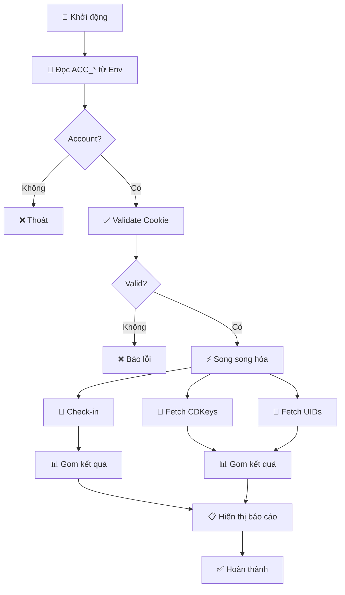

# 🎮 HoYoLab Auto Tool

[](https://www.python.org/downloads/)
[](https://opensource.org/licenses/MIT)
[](https://github.com/psf/black)

Tự động **điểm danh hàng ngày** và **nhập redeem code** cho 3 game HoYoverse thông qua GitHub Actions.

## ✨ Tính năng

| Tính năng | Mô tả |
|-----------|-------|
| 🎁 **Auto Check-in** | Điểm danh hàng ngày nhận phần thưởng |
| 🔑 **Auto Redeem** | Tự động nhập mã code mới nhất |
| 🔄 **Multi-Account** | Hỗ trợ nhiều tài khoản |
| ⚡ **Cross-region Skip** | Tự động bỏ qua code hết hạn |
| 🚀 **High Performance** | Tối ưu tốc độ với kiến trúc song song (Parallel) |
| 🛡️ **Stealth Mode** | Header động tránh bị phát hiện |

## 🎯 Game được hỗ trợ

| Game | Check-in | Redeem |
|------|----------|--------|
| Genshin Impact | ✅ | ✅ |
| Honkai: Star Rail | ✅ | ✅ |
| Zenless Zone Zero | ✅ | ✅ |

## 🏗️ Kiến trúc hệ thống


```mermaid
flowchart TD
    A[🚀 Khởi động] --> B[📖 Đọc ACC_* từ Env]
    B --> C{Account?}
    C -->|Không| X[❌ Thoát]
    C -->|Có| D[✅ Validate Cookie]
    D --> E{Valid?}
    E -->|Không| Y[❌ Báo lỗi]
    E -->|Có| F[⚡ Song song hóa]
    
    F --> G1[🎁 Check-in]
    F --> G2[🔑 Fetch CDKeys]
    F --> G3[🔑 Fetch UIDs]
    
    G1 --> H1[📊 Gom kết quả]
    G2 --> H2[📊 Gom kết quả]
    G3 --> H2
    
    H1 --> I[📋 Hiển thị báo cáo]
    H2 --> I
    
    I --> J[✅ Hoàn thành]
```

## 🚀 Bắt đầu nhanh

### 1. Fork Repository

Click **Fork** ở góc phải trên GitHub.

### 2. Lấy Cookie

1. Truy cập [HoYoLab](https://www.hoyolab.com) và **đăng nhập**
2. Click vào avatar → **Personal Homepage**
3. Mở **DevTools** (F12) → Tab **Network**
4. Tìm request: `getGameRecordCard?uid=...`
5. Click vào request → **Headers** → Copy giá trị **Cookie**

```
Cookie: mi18nLang=en-us; _MHYUUID=xxx; cookie_token_v2=xxx; account_id_v2=xxx; ...
```

> ⚠️ **Lưu ý:** Cookie này sẽ dán vào GitHub Secrets - KHÔNG commit vào code!

### 3. Thêm Secrets

1. Vào repo đã fork → **Settings** → **Secrets and variables** → **Actions**
2. Click **New repository secret**
3. **Name**: `ACC_1` (hoặc `ACC_2`, `ACC_3`,...)
4. **Value**: Dán cookie string vừa copy
5. Lặp lại cho mỗi account

> 💡 GitHub Actions sẽ tự nhận diện các biến `ACC_*` khi chạy!

### 4. Chạy Workflow

- **Tự động**: Mỗi ngày lúc **4:45 AM (UTC+7)**
- **Thủ công**: **Actions** → **Daily Run** → **Run workflow**

## 📁 Cấu trúc dự án

```
hoyoverse-utility/
├── .github/workflows/
│   └── hoyo-flow.yml          # GitHub Actions workflow
├── src/
│   ├── main.py                # Entry point chính
│   ├── config.py              # Cấu hình tập trung (URLs, RPC, SYSTEM_MESSAGES, settings)
│   ├── constants.py           # Hằng dùng chung (JSON_SEPARATORS, DEFAULT_CHROME_VERSION, DEFAULT_SOURCE_INFO)
│   ├── api/
│   │   ├── client.py          # HTTP client với retry & semaphore
│   │   ├── checkin.py         # API điểm danh
│   │   └── redeem.py          # API nhập code
│   ├── models/
│   │   ├── account.py         # Model tài khoản
│   │   └── game.py            # Model game & region (REGIONS = region code → API value)
│   └── utils/
│       ├── headers.py         # Dynamic User-Agent
│       ├── helpers.py         # Hàm tiện ích (build_rpc_headers, ...)
│       ├── logger.py         # Logging với trace_id
│       └── security.py       # Mask dữ liệu nhạy cảm
├── tests/                     # Test suite
│   ├── auth/                  # Các file authentication local (không bị push lên repo)
│   ├── configs/               # Cấu hình phụ trợ cho Pytest
│   ├── integration/           # Chạy End-to-end integration tests
│   ├── scripts/               # Script hỗ trợ Debug API
│   ├── unit/                  # Unit tests cho từng module
│   └── conftest.py            # Fixtures & Mock data chung
├── requirements/              # Chứa SPEC và Architecture mô tả nghiệp vụ Tool
├── requirements.txt           # Product dependencies (Không bao gồm Pytest libs)
└── README.md                  # File này
```

## 🔧 Phát triển local

```bash
# Clone
git clone https://github.com/your-username/hoyoverse-utility.git
cd hoyoverse-utility

# Tạo virtual environment
python -m venv .venv
.\.venv\Scripts\activate  # Windows
source .venv/bin/activate  # Linux/Mac

# Cài đặt dependencies (Core)
pip install -r requirements.txt

# Cấu hình cookie cho local test
# 1. Copy tests/auth/cookies.ps1.example -> tests/auth/.env.ps1
# 2. Điền cookies vào tests/auth/.env.ps1
# 3. Chạy file:
.\tests\auth\.env.ps1

# Chạy tool
python -m src.main

# Chạy test (Mock data - không cần cookie)
pip install -r tests/configs/requirements.txt
python -m pytest tests/ -v
```

## 📊 Ví dụ output

```
20/01/2026 07:38:22 [INFO] ==================================================
20/01/2026 07:38:22 [INFO] HOYOLAB AUTO TOOL
20/01/2026 07:38:23 [INFO] ==================================================
20/01/2026 07:38:23 [INFO] --- KIỂM TRA ACCOUNTS ---
20/01/2026 07:38:23 [INFO] [✓] ACC_1: Hợp lệ (u****@gmail.com)
20/01/2026 07:38:23 [INFO]
20/01/2026 07:38:24 [INFO] --- CHECK-IN ---
20/01/2026 07:38:24 [INFO] === ACC_1 ===
20/01/2026 07:38:24 [INFO]   Genshin Impact: ✓ Điểm danh thành công (Ngày 15)
20/01/2026 07:38:24 [INFO]   Honkai: Star Rail: ✓ Đã điểm danh trước đó
20/01/2026 07:38:24 [INFO]
20/01/2026 07:38:24 [INFO] --- REDEEM CODE ---
20/01/2026 07:38:24 [INFO] >> Fetching CDKeys...
20/01/2026 07:38:24 [INFO] [SYSTEM] Genshin Impact: 3 codes [ABC, DEF, XYZ]
20/01/2026 07:38:24 [INFO]
20/01/2026 07:38:24 [INFO] === ACC_1 ===
20/01/2026 07:38:24 [INFO]   Genshin Impact:
20/01/2026 07:38:24 [INFO]     asia:
20/01/2026 07:38:24 [INFO]       ABC: ✓ Thành công
20/01/2026 07:38:24 [INFO]
20/01/2026 07:38:24 [INFO] ==================================================
20/01/2026 07:38:24 [INFO] DONE - 1.1s
20/01/2026 07:38:24 [INFO] ==================================================
```

## ⚙️ Cấu hình nâng cao

### Environment Variables

| Variable | Mô tả | Mặc định |
|----------|-------|----------|
| `ACC_*` | Cookie strings (ACC_1, ACC_2,...) | Bắt buộc |
| `DEBUG` | Bật debug mode | `""` |
| `LOG_LEVEL` | **Output format** (không phải log level): `human`, `json`, `both` | `human` |

### Settings (trong [`src/config.py`](src/config.py))

```python
SEMAPHORE_LIMIT = 20      # Số request song song tối đa
REDEEM_DELAY = 5          # Giây giữa mỗi lần nhập code
REQUEST_TIMEOUT = 30      # Timeout request (giây)
CONNECT_TIMEOUT = 10      # Timeout kết nối (giây)
MAX_RETRIES = 3           # Số lần thử lại khi lỗi
RATE_LIMIT_DELAY = 5      # Giây chờ khi bị rate limit (429)
HEADER_WIDTH = 50         # Số ký tự "=" cho header/footer (display)
```

Display và RPC: `HEADER_WIDTH`, `DEFAULT_SOURCE_INFO` (constants), `DEFAULT_LOG_LEVEL` — xem `src/config.py` và `src/constants.py`.

## ❓ Troubleshooting

### Cookie không hợp lệ

```
[✗] ACC_1: Missing required cookies: ['account_id_v2']
```

**Giải pháp:**
1. Lấy lại cookie từ HoYoLab (xem hướng dẫn trên)
2. Đảm bảo cookie có đầy đủ các trường: `_MHYUUID`, `_HYVUUID`, `cookie_token_v2`, `account_id_v2`

### Không tìm thấy account

```
ERROR: Không tìm thấy account nào trong environment variables!
```

**Giải pháp:**
1. Kiểm tra GitHub Secrets đã thêm `ACC_1` chưa
2. Verify tên secret khớp với env var (ACC_1, ACC_2,...)
3. Chạy lại workflow thủ công

### Lỗi rate limit

```
[ERROR] Request failed: Rate limited (429)
```

**Giải pháp:**
1. Đợi một thời gian rồi chạy lại
2. Giảm số lượng account
3. Đợi 24h để reset limit

### Code bị skip liên tục

```
ABC: ⏭ Đã skip (expired/invalid từ region trước)
```

**Giải pháp:**
- Code đã hết hạn hoặc không hợp lệ (tool tự skip ở các region sau để tiết kiệm request)
- Chờ code mới từ livestream/event

## 📝 Changelog

**Cập nhật gần đây:**

- **DRY (trước đó):** RPC headers, page names, message skip trong `config.py` / `constants.py`; ZZZ Stealth Mode; Dynamic Page Info.

## 🔐 Bảo mật

> **QUAN TRỌNG:**
> - **KHÔNG** bao giờ commit cookies vào repository!
> - Cookies có giá trị ~1 năm, sau đó cần lấy lại
> - Delay 5s giữa mỗi lần nhập code để tránh rate limit
> - API có thể thay đổi từ phía HoYoverse bất cứ lúc nào

## 📝 License

MIT License - Chỉ dành cho mục đích cá nhân.

---

<p align="center">
  Made with ❤️ for Travelers, Trailblazers & Proxies
</p>
